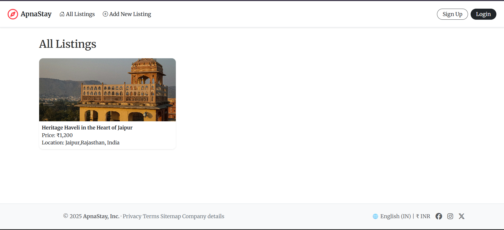
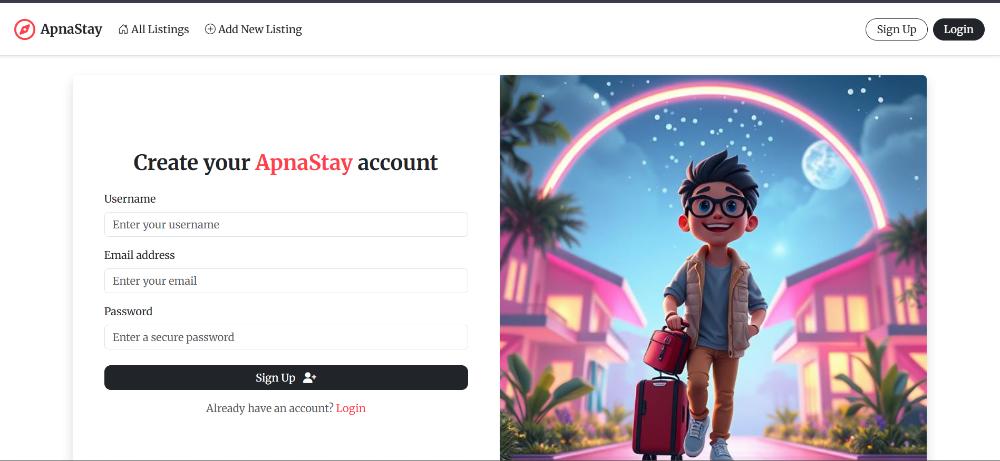
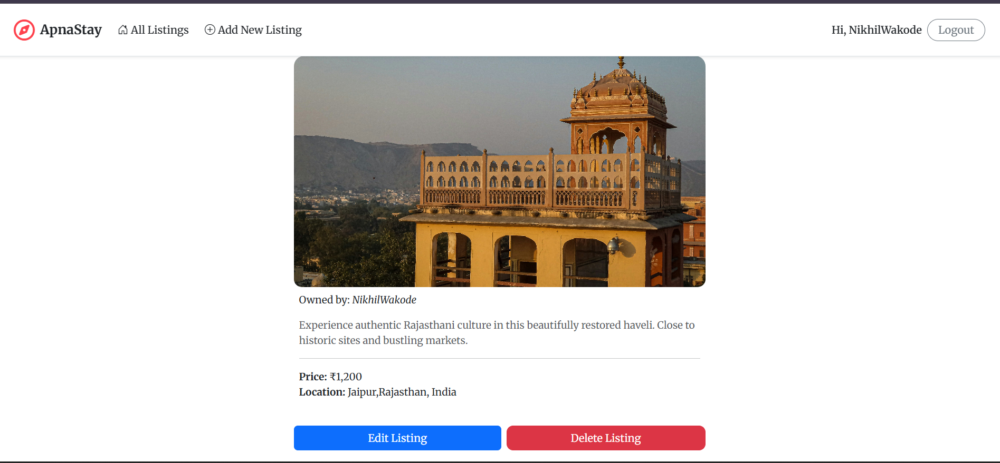

# 🧭 ApnaStay

A full-featured **room & property listing platform** inspired by Airbnb — built using **Node.js, Express, MongoDB, EJS**, and **Cloudinary**. Users can sign up, log in, create, browse, and filter listings, as well as leave reviews.

---

## ✨ Features

- 🔐 **User Authentication** (Passport Local)
- 🏘️ **Add/Edit/Delete Listings**
- ⭐ **Review System with Ratings**
- ☁️ **Cloudinary Image Uploads**
- 📦 **Flash Messages & Validation**
- 💬 Clean & Modern UI (Bootstrap 5)
- 🛠️ MVC Folder Structure

---

## 🖼️ UI Screenshots 

  
  
  

---

## ⚙️ Tech Stack

| Tech | Description |
|------|-------------|
| `Node.js` | Backend runtime |
| `Express.js` | Web framework |
| `MongoDB` + `Mongoose` | NoSQL database |
| `EJS` | Templating engine |
| `Passport.js` | User Authentication |
| `Cloudinary` | Image Hosting |
| `Multer` | File Uploads |
| `Bootstrap 5` | UI Components |

---

## 📂 Project Structure

ApnaStay/
├── app.js                # Main Express server file  
├── .env                  # Environment variables  
├── README.md             # Project documentation  
│  
├── models/               # Mongoose schemas (Listing, User, Review)  
├── controllers/          # Route logic (listings.js, users.js, reviews.js)  
├── routes/               # Express route handlers  
├── views/                # EJS templates (layouts, includes, users, listings)  
│  
├── public/               # Static assets  
│   ├── css/              # Custom styles  
│   ├── js/               # Client-side scripts  
│   └── images/           # App images (logo, login/signup images, etc.)  
│  
├── cloudinary/           # Cloudinary storage config (index.js)  
├── utils/                # Custom middleware (wrapAsync, ExpressError, etc.)  


---

## 🔐 Environment Variables

- MONGO_URL=your_mongo_db_uri   
- CLOUDINARY_CLOUD_NAME=your_cloud_name
- CLOUDINARY_KEY=your_cloudinary_key
- CLOUDINARY_SECRET=your_cloudinary_secret
- SECRET=your_secure_session_key

---

## 🛠️ Installation

```bash
git clone https://github.com/NikhilNWakode/Apnastay.git
cd Apnastay
npm install
